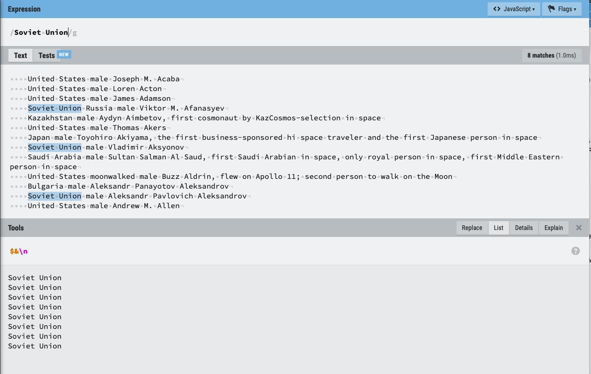

## Part 1

These materials are for the first part of the regular expression workshop.

You may find [this cheatsheet](https://paulvanderlaken.files.wordpress.com/2017/08/davechild_regular-expressions.pdf) to be a useful reference.

## What are regular expressions?

Regular expressions are patterns we can use to search text.  These patterns are built using a special syntax that allows us to express different concepts, such as character classes, repetition, and the beginning and end of text.  This syntax can vary across different implementations of regular expressions (in different programming languages), but there are some common components.  

Regular expression is often shortened to regex (say: reg-ex).  

### Why use regular expressions?

Regular expressions let us extract information from text or change text when 1) there is some structure, but 2) the specific content may vary.  

For example, if we're working with tweets:

<blockquote class="twitter-tweet"><p lang="en" dir="ltr">Looking for <a href="https://twitter.com/hashtag/EarthDay?src=hash&amp;ref_src=twsrc%5Etfw">#EarthDay</a> fun? Look no further!<br><br>Register for our all-day event: <a href="https://t.co/OVnjNU2ZXb">https://t.co/OVnjNU2ZXb</a><br><br>Set a reminder to watch on <a href="https://t.co/z1RgZwQkWS">https://t.co/z1RgZwQkWS</a>:<br>🛰️ 11am ET - Q&amp;A with astronauts in space, hosted by <a href="https://twitter.com/ShawnMendes?ref_src=twsrc%5Etfw">@ShawnMendes</a><br>🌳 3pm ET - <a href="https://twitter.com/hashtag/NASAScience?src=hash&amp;ref_src=twsrc%5Etfw">#NASAScience</a> Live Q&amp;A with <a href="https://twitter.com/NASAClimate?ref_src=twsrc%5Etfw">@NASAClimate</a> experts <a href="https://t.co/B6WnYYHcBl">pic.twitter.com/B6WnYYHcBl</a></p>&mdash; NASA (@NASA) <a href="https://twitter.com/NASA/status/1385241483201110016?ref_src=twsrc%5Etfw">April 22, 2021</a></blockquote> <script async src="https://platform.twitter.com/widgets.js" charset="utf-8"></script> 

How do we get the links or hash tags out?  We know there are links and hash tags.  We can identify them with `@` or `#`, which provides some structure.  But the content (the specific link or hash tag) differs.

The data we're going to work with is copied from a [list of astronauts from Wikipedia](https://en.wikipedia.org/wiki/List_of_space_travelers_by_name
) with a few minor edits: 

```
    United States male Joseph M. Acaba
    United States male Loren Acton
    United States male James Adamson
    Soviet Union Russia male Viktor M. Afanasyev
    Kazakhstan male Aydyn Aimbetov, first cosmonaut by KazCosmos-selection in space
    United States male Thomas Akers
    Japan male Toyohiro Akiyama, the first business-sponsored hi space traveler and the first Japanese person in space
    Soviet Union male Vladimir Aksyonov
    Saudi Arabia male Sultan Salman Al Saud, first Saudi Arabian in space, only royal person in space, first Middle Eastern person in space
    United States male Buzz Aldrin, moonwalked, flew on Apollo 11; second person to walk on the Moon
    Bulgaria male Aleksandr Panayotov Aleksandrov
    Soviet Union male Aleksandr Pavlovich Aleksandrov
    United States male Andrew M. Allen
    United States male Joseph P. Allen
    United Arab Emirates male Hazza Al Mansouri, first UAE astronaut
    United States male Scott Altman
    United States male William Anders, first Asian-born person in space (born in Hong Kong, but an American citizen)
    United States male Clayton Anderson
    United States male Michael P. Anderson (1959–2003), died on February 1, 2003, in the Space Shuttle Columbia disaster of STS-107[7]
    Iran United States female Anousheh Ansari, fourth spaceflight participant, first woman of Muslim descent in space, and first Iranian in space
    United States male Dominic A. Antonelli
    United States male Jerome Apt
    United States male Lee Archambault
    United States male Neil Armstrong (1930–2012), moonwalked, flew on Apollo 11; first person to walk on the Moon[8]
    United States male Richard R. Arnold
    Russia male Oleg Artemyev
    Soviet Union male Anatoly Artsebarsky
    Soviet Union male Yuri Artyukhin (1930–1998)[9]
    United States male Jeffrey Ashby
    Soviet Union male Oleg Atkov
    Soviet Union male Toktar Aubakirov, first Kazakh born person in space
    United States female Serena Auñón-Chancellor
    Soviet Union Russia male Sergei Avdeyev
```

How do we get this into a format that we could use?

## Concept 1: Fixed Matches

While we don't generally need regular expressions to match a specific string of text, we can use them that way.  For example, if we want to find all instances of `Soviet Union` in our astronaut list, then we can do that.  

We're going to use an online tool called RegExr to practice regular expressions.  



You can [open the tool](http://regexr.com/5rddd) with the astronaut text loaded.  Click on the List option for the bottom pane to see the match results.

In this tool, you type the regular expression in between `//` at the top.  In Python and R, the regular expression will be an input to a function instead, so you'll express it as a string or a special raw string designed for use with regular expressions.  

Here, the "flags" are represented after the slash.  While you'll specify these differently in other languages, the concepts are the same.  The two flags to know about at this point are:

* global (g): find ALL matches in the text, not just the first one
* case insensitive (i): if this flag is "on", then "a" matches both "a" and "A"; otherwise, matches are case sensitive

In our example, our regular expression is `Soviet Union`.  This will look for exact matches to these characters.

### EXERCISE 1

Open the [example](https://regexr.com/5rddd):

1. Change the pattern to: `soviet union` (all lowercase) - does it still match?
2. Change the pattern to find female astronauts.  Type the number of times "female" is found in the text in the chat.


## Concept 2: Match Anything

Now we're going to start to learn the metacharacters -- the characters that have special meaning and don't match literally.  

The first one is a `.`, which we call "dot" when reading regular expressions out loud - it is the period/full stop/sentence terminator.  It matches any one single character EXCEPT the new line `\n`.  You can use multiple `.` in the same expression.

What do we do then if we want to match an actual period in the text?  We need to escape the `.` to tell the regular expression processor not to treat it as a metacharacter.  We do this with a `\`: for example: `\.`  This will then only match a `.`

*Advanced note: there's a flag that you can set to make `.` also match `\n`; the flag is generally called dotall.*  


### Example

Text:
```
The Cat in the Hat
```

Regular Expression: `..t`

Matches:
```
Cat
n t
Hat
```

### Example

Text:
```
It. is. wonderful. isn't it?
```

Regular Expression: `is\.`

Matches:
```
is.
```


### EXERCISE 2

Open the [blank example](https://regexr.com/5rddd).  

1. Write a regular expression to find any substrings consisting of a capital A, followed by any character, followed by a lower case a.  For example, the regex should match both `Aca` and `Ada`.  Remember to click on the List option in the bottom pane to see the matches.  Type the last match in the chat.  
2. Write a regular expression to find any 5 letter sequences starting with A and ending with n.  
3. Write an expression to find actual period marks in the text.  How many are there?  Put the answer in the chat.  

For part 2 of the exercise above, you'll notice that the pattern matches across words.  We'll learn about word boundaries (`\b`) in [Part 2](part2.html) of the workshop.

## Concept 3: Repetition

We don't want to have to type a bunch of `.....` to match multiple characters.  So how do we match more than one character at once?  We can use quantifiers.  Quantifiers apply to the part of the regular expression immediately before them.  So far, this means the single character immediately before the quantifier, but we'll soon learn about other components of regular expressions.

Quantifiers:

* `*` matches the preceeding character 0 or more times.  This means the preceeding character is "optional" or doesn't have to be included at all.
* `+` matches the preceeding character 1 or more times.  The character has to be present at least once.
* `?` matches the preceeding character 0 or 1 times.  The character can be present or absent.
* `{3}` matches the preceeding character exactly 3 times.  You can use a number other than 3.
* `{3,}` matches the preceeding character at least 3 times.  You can use a number other than 3.
* `{3,5}` matches the preceeding character between 3 and 5 times (3, 4, or 5 times).  You can substitute in other numbers.

When there are multiple matches, you get the longest possible match by default.  You also only get non-overlapping matches.


### Example

Text:
```
The bee goes buzz buzzz buzzzz...
```

Regular Expression: `z+`

Matches:
```
zz
zzz
zzzz
```

Regular Expression: `z{2} `

Matches:
```
zz
zz
zz
zz
```

Yes, there are 4 matches -- can you find them?  You get non-overlapping matches


Regular Expression: `b.+z`

Matches:
```
bee goes buzz buzzz buzzzz
```

Regular Expression: `buzzz?`

Matches:
```
buzz
buzzz
buzzz
```


### EXERCISE 3

Open the [blank example](https://regexr.com/5rddd).  

1. Repeat the exercise above, but use a quantifier this time: Write a regular expression to find any 5 letter sequences starting with A and ending with n.  
2. Find any sequences of 2 or more spaces (the character made by the space bar key on your keyboard).  

CHALLENGE: write an expression that will match either `male` or `female` and no other words in the example text.


## Concept 4: Limiting Repetition

The `*` and `+` quantifiers will match the maximum sequence possible.  We call this "greedy" matching.  If we want it to match the minimum sequence possible, while the regex still matches something if at all possible, then we can combine them with `?` to make the quantifiers "non-greedy": `*?` and `+?`.   

### Example

Text (from the Astronaut example):
```
United States died male Michael P. Anderson (1959–2003), died on February 1, 2003, in the Space Shuttle Columbia disaster of STS-107[7]
```

Regular expression: `A.+n`  (greedy matching)

Matches:
```
Anderson (1959–2003), died on February 1, 2003, in
```

It matches from the first A until the last n in the line, skipping over other "n"s.  This is the "greedy" behavior of `+` -- to match as much as possible and still have the entire expression match.  

What if we just want to match `Anderson`?  That's when we use a non-greedy quantifier.

Regular expression: `A.+?n`  (non-greedy matching)

Matches:
```
Anderson
```

The expression needs to match an "A", then at least one other character (`.+?`), and then an "n".  `.+?` can match an "n", but it doesn't count as the same "n" at the end of the expression.  `A.*?n` would match "An" only, instead of "Anderson", because `.*?` can match 0 characters -- there doesn't need to be another character in between "A" and "n".

### EXERCISE 4

Open the [blank example](https://regexr.com/5rddd).  

Write an expression using a non-greedy quantifier that matches both `United States` and `United Arab Emirates` and no other words in the astronaut text.


## Concept 5: Character Classes

What if we want to be more general than a fixed string, but more specific than matching anything with `.`?  We can use character classes.  

There are a few pre-defined character classes:
* `\s` whitespace (spaces, tabs `\t`, newlines `\n`)
* `\S` NOT whitespace (everything else)
* `\d` digits 0-9
* `\D` NOT digits (everything else)
* `\w` "word" characters: the definition can vary slightly, but basically letters (both cases), digits, and underscore 
* `\W` NOT word characters
* 
Each of these matches a single character in the text that fits the criteria.  For example, `\d` matched against `1234` matches `1`, `2`, `3`, and `4` separately.

You can also define your own character groups by typing a set of characters inside `[]`.  For example `[abc]` would match a or b or c.  The bracketted set of characters only matches one character at a time.  So the first match of `[act]` to `cat` is only `c`.  Character groups and classes can be combined with quantifiers; remember that the quantifier affects whatever is immediately before it -- a single character, a character class, or a character group.  So `[act]+` applied to `cat` would match all of `cat`.  

Remember: unless otherwise specified, regular expressions are case-sensitive.  This means "c" and "C" are different characters as part of a character group in `[]`.  

*Note: On the [cheat sheet](https://paulvanderlaken.files.wordpress.com/2017/08/davechild_regular-expressions.pdf), you'll see a POSIX section.  In some implementations of regular expressions, instead of using `\d` for digits, you'd use `[:digit:]`.  Similar for other character classes.*

### Example

Text:
```
You have good decision-making skills.
```

Regular Expression: `d\w+`

Matches:
```
decision
```

Regular Expression: `\w{4}\s\w{4}`

Matches:
```
have good
king skil
```


### Example

Text:
```
The cat, bat, and gnat all wore a hat.
```

Regular Expression: `[bcgn]at`

Matches:
```
cat
bat
nat
```

Note: the expressions matches "nat" not "gnat" because `[bcgn]` only matches a single character.  The regex doesn't match "hat" because "h" isn't in the character class.


### EXERCISE 5

Open the [blank example](https://regexr.com/5rddd).  

1. Write an expression to find a digit followed by a comma `,`
2. Use a character class to write an expression to match both `moon` and `Moon` - type how many times variations on moon appear in the chat.

CHALLENGE: Write an expression to find all capitalized words in the example text.  The expression should only match the letters in the word and not include any spaces before or after it.  You probably want to include the character class for word characters noted above, and looking ahead to the bonus concept below will help you out.

Note for challenge: The answer would also match parts of strings where the capital letter isn't at the start (e.g. "elNiri"), but there aren't any cases like that in our example data, so we won't worry about that!  We'll learn how to actually deal with word boundaries in Part 2.  


## Bonus Concept: Ranges in Character Groups

Character classes can be defined by listing each character that should be included, but we can also use [ranges of characters](https://chortle.ccsu.edu/finiteautomata/Section07/sect07_11.html).  For example, to make a character class with all of the (US English) lower case letters, we can do: `[a-z]`.  

Ranges can be combined by just typing them next to each other.  For example, all lower and upper case US English letters: `[A-Za-z]`.  Note: `[A-Za-z]` is different than `[A-z]`.  The latter includes some non-alphabet characters between Z and a.  The order of the characters is based on [ASCII](https://en.wikipedia.org/wiki/ASCII) or other encoding standards such as [UTF-8](https://en.wikipedia.org/wiki/UTF-8) depending on which encoding you're using.


## Bonus Concept: Opposite of Character Groups

By including a `^` as the first character inside a character group, it makes the expression mean everything EXCEPT the characters in the group.  

### Example

Text:
```
bat
```

Regular Expression: `[^abc]` 

Matches:
```
t
```

"b" and "a" are both in the character group, but the `^` defines the character group to be anything EXCEPT "a", "b", or "c".


## Additional Practice/Review

We've covered about 3/4 of the material at [RegexOne](https://regexone.com/).  It's a good resource to review the above concepts and try some additional exercises.

Also, check out our [resource guide for free, online learning resources](https://sites.northwestern.edu/researchcomputing/2021/03/04/online-learning-resources-regular-expressions/).

Next up in this series: [Part 2](part2.html)

## Answers

If you want the answers to the above exercises for reference later (don't cheat during the workshop!), you can find them [here](part1_answers.html).
