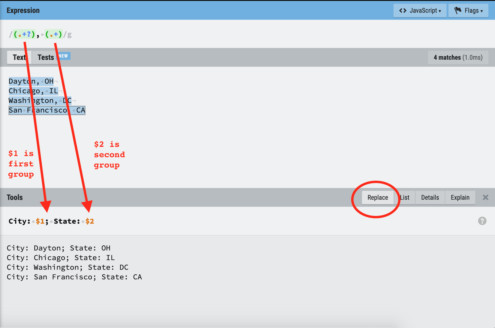

## Regular Expressions Workshop: Part 2

These materials are for part 2 of the regular expressions workshop.  

[Part 1 materials](part1.html)

You may find [this cheatsheet](https://paulvanderlaken.files.wordpress.com/2017/08/davechild_regular-expressions.pdf) to be a useful reference.

## Example Text

We are going to continue to work with text copied from a [list of astronauts on Wikipedia](https://en.wikipedia.org/wiki/List_of_space_travelers_by_name
) that we used in [Part 1](part1.html): 

```
    United States male Joseph M. Acaba
    United States male Loren Acton
    United States male James Adamson
    Soviet Union Russia male Viktor M. Afanasyev
    Kazakhstan male Aydyn Aimbetov, first cosmonaut by KazCosmos-selection in space
    United States male Thomas Akers
    Japan male Toyohiro Akiyama, the first business-sponsored hi space traveler and the first Japanese person in space
    Soviet Union male Vladimir Aksyonov
    Saudi Arabia male Sultan Salman Al Saud, first Saudi Arabian in space, only royal person in space, first Middle Eastern person in space
    United States male Buzz Aldrin, moonwalked, flew on Apollo 11; second person to walk on the Moon
    Bulgaria male Aleksandr Panayotov Aleksandrov
    Soviet Union male Aleksandr Pavlovich Aleksandrov
    United States male Andrew M. Allen
    United States male Joseph P. Allen
    United Arab Emirates male Hazza Al Mansouri, first UAE astronaut
    United States male Scott Altman
    United States male William Anders, first Asian-born person in space (born in Hong Kong, but an American citizen)
    United States male Clayton Anderson
    United States male Michael P. Anderson (1959–2003), died on February 1, 2003, in the Space Shuttle Columbia disaster of STS-107[7]
    Iran United States female Anousheh Ansari, fourth spaceflight participant, first woman of Muslim descent in space, and first Iranian in space
    United States male Dominic A. Antonelli
    United States male Jerome Apt
    United States male Lee Archambault
    United States male Neil Armstrong (1930–2012), moonwalked, flew on Apollo 11; first person to walk on the Moon[8]
    United States male Richard R. Arnold
    Russia male Oleg Artemyev
    Soviet Union male Anatoly Artsebarsky
    Soviet Union male Yuri Artyukhin (1930–1998)[9]
    United States male Jeffrey Ashby
    Soviet Union male Oleg Atkov
    Soviet Union male Toktar Aubakirov, first Kazakh born person in space
    United States female Serena Auñón-Chancellor
    Soviet Union Russia male Sergei Avdeyev
```

## Concept 1: Word Boundaries

In [Part 1](part1.html), we wrote some regular expressions that matched across words or in the middle of words.  Sometimes, we can use spaces to denote the edges of words, but what about cases where a word is followed by punctuation, or when a word starts a line of text?  Luckily, we have a way to indicate a word boundary: `\b`.  This doesn't match a specific character.  Instead, it matches any transition between word (`\w`) and non-word (`\W`) characters.  Recall from last time that word characters are letters, digits, and underscores (it gets more complicated with non-ASCII text, but the same concept applies).

### Example

Text:
```
Alex identifies as female, and Casey identifies as male.
```

Regular Expression: `\bmale`

Matches:
```
male
```

With the word boundary `\b` at the beginning of the expression, it only matches the "male" at the end of the sentence.  It does not match the "male" in "female" like `male` without a word boundary indicator would.


### EXERCISE 1

Open the [blank example](regexr.com/5rddd). 

Write a regular expression to find all words that end in a `y`.  Have your expression match the entire word, not just the ending `y`.  Hint: recall `\w` will match any "word" characters, which may help for capturing the first part of the word that isn't "y".  Need a refresher on how to represent [repetition](part1.html#concept-3-repetition)?

Type the last word that you match in the chat when you're done.


## Concept 2: Beginning and End of Lines

Similar to how we can match the beginning and end of words, we can also match the beginning `^` and end `$` of lines.  

There are two definitions of "line" that you may encounter.  By default, a line is the full text you are matching against.  `^` matches the beginning of the full text you're matching against, and `$` is the end of the full text you're matching against.

With the "multiline" flag, you can instead specify a line is terminated by `\n`, so there can be multiple lines in the text you're matching.  

*Note: line endings are actually a bit more complicated than this.  On Windows systems, when you type ente/return, you actually get `\r\n`; with Mac/Unix, you just get `\n`.  The `\r` is a carriage return (CR).  The `\n` is a line feed (LF).  In either case, `\n` is the last character, but with Windows, there may also be a `\r`. You might see `\r\n` noted as CRLF, and `\n` as LF.*

### Example

Text:
```
This is line 1
This is line 2
This is line 3
```

Regular Expression: `.$`, **without** the multiline flag

Matches:
```
3
```

Regular Expression: `.$`, **WITH** the multiline flag

Matches:
```
1
2
3
```

### EXERCISE 2

Open the [blank example](regexr.com/5rddd).  Under the "Flags" menu in the upper left, turn on the "multiline" option (should be checked) so that the text is treated as multiple lines, not just one.

Write a regular expression to match any number of spaces (0 or more) at the beginning of each line of the text.  

Spaces are visualized in the text in the RegExr tool with a circle.  

Hint: Need a refresher on how to represent [repetition](part1.html#concept-3-repetition)?  

## Concept 3: Groups

With regular expressions, we can go beyond matching text to extracting or changing text.  When doing that, sometimes it's helpful to retrieve or identify only part of an expression, rather that the whole thing.  For example, if you want to capture text between html tags, without including the html tags.  Or information inside parentheses.  Or part of a filename.  

We denote a group with parentheses `()`.  

This means that if we want to match an actual `(` or `)` in the text, we'll need to escape it: `\(` or `\)`.  

We'll get into more detail on this shortly, but each group we include in the regular expression gets a number, starting with 1.  We can use these numbers to refer to the text that each group matches.

### Example

Text:
```
Dayton, OH
Chicago, IL
Washington, DC
San Francisco, CA
```

Regular Expression: `, ([A-Z]{2})`

The **entire expression** matches:
```
, OH
, IL
, DC
, CA
```

*Note: The regular expression above requires capital letters to make sure we're matching a state abbreviation.  But this more general regular expression would also work: `, (.{2})` (match any two characters after a comma and space) or even `, (.+)` (match 1 or more characters after a comma and a space).  Which regular expression is appropriate will depend on the specific text you're matching, and sometimes it takes some trial and error to make an expression specific enough or general enough to match everything that you want, but only what you want.*

The **group** (in parentheses) matches:
```
OH
IL
DC
CA
```


### EXERCISE 3A


Open the [blank example](regexr.com/5rddd).  Under the "Flags" menu in the upper left, turn on the "multiline" option (should be checked) so that the text is treated as multiple lines, not just one.

To see the results of the group match, instead of the entire expression, in the bottom, change `$&\n` to `$1\n`.  The `1` is for the first group in the expression you'll write.

Recall that `^ *` matched the spaces at the beginning of the line.

Now **write a regular expression that includes a group to capture the first letter that appears after those spaces at the beginning of the line**.


### EXERCISE 3B

Open the [blank example](regexr.com/5rddd).  Under the "Flags" menu in the upper left, turn on the "multiline" option (should be checked) so that the text is treated as multiple lines, not just one.

To see the results of the group match in the bottom, , instead of the entire expression, change `$&\n` to `$1\n`.  The `1` is for the first group in the expression you'll write.

Recall that we've written two regular expressions before:

* Match spaces at the beginning of the line: `^ *`
* Match male or female (challenge from Part 1): `f?e?male`

Using these components, we want to **write a regular expression to capture the name of the country in each line with a group.**  The country name comes after the beginning of the line and the spaces, and before a space and then male or female.  Combine these components with a new part of a regular expression that includes a group to capture the name of the country.  

Hint: You'll probably want a non-greedy quantifier: `.+?` will match 1 or more characters, until the next part of the expression matches.  

## Concept 4: Substitutions

Groups are also useful when you want to change or replace text (or substite, or sub for short), rather than just extracting it.  Instead of just writing an expression to match text, you also need to write an expression of what to replace the text with.  You can reference the text matched by groups by number -- the groups are numbered from left to right in the expression.  The group references typically use either `$1` or `\1` as reference to the first group.  Whether it's a `$` or `\` depends on the system.  Python and R use `\#` to refer to groups (where `#` is the number of the group).

In the RegExr tool we're using here, we use `$#` to refer to a group:



In the example above, we have two groups in the regular expression at the top: one to match the city, and one to match the state.  The comma and space are part of the regular expression but not in either group.  To write a replacement expression in RegExr, for the bottom pane, choose the Replace option on the right.  Then you can write an expression referencing the groups and adding other text as needed.

### EXERCISE 4

Open the [blank example](regexr.com/5rddd). Click on Replace for the bottom tab so that you can substitute or replace text.  Turn on the multiline flag.

Enter this regular expression: `^ *(.+?) (f?e?male)`

Write a replacement expression so that the first few lines of output look like the following, with the name of the country, followed by a colon and space, and then the rest of the information from each line, minus male/female.

Example output:
```
United States: Joseph M. Acaba
United States: Loren Acton
United States: James Adamson
Soviet Union Russia: Viktor M. Afanasyev
Kazakhstan: Aydyn Aimbetov, first cosmonaut by KazCosmos-selection in space
United States: Thomas Akers
```

## Concept 5: Or `|`

The vertical pipe `|` indicates a logical "or" in an expression.  It lets us provide two different options as to what might match (or more than two if we use more than one `|`).  When used in an expression, `left|right`, everything to the left of `|` is one expression, and everything to the right is another, unless `|` appears inside a group `()`.  You can sometimes get unexpected behavior with `|` outside of groups, so putting it in a group, even if you don't otherwise need one, is often a good idea.  


### Example

Text:
```
Iran United States female Anousheh Ansari
United States male Dominic A. Antonelli
United States male Jerome Apt
United States male Lee Archambault
```

Regular Expression: `male|female`

Matches:
```
female
male
male
male
```


### EXERCISE 5

Open the [blank example](regexr.com/5rddd). Click on Replace for the bottom tab so that you can substitute or replace text.  Turn on the multiline flag.

We're going to finally turn the astronaut text into a data set that we could maybe use.  We want to extract the three pieces of information that appear in every line: country, male or female, and name.  We want to convert these to be comma separated values, meaning there is a comma between each piece of information on the same line.  We want to discard all other information.

Fair warning: we're going to have to put together lots of pieces we've learned in the first two parts of this workshop to write an expression that is much more complicated than the previous exercises.  This is a signifcant step up in difficulty.  We're going to approach it in parts.

#### Part 1

There are two types of lines in the text:

* Ones with 4 spaces, then country, space, male/female, space, name, end of the line
* Ones with the info we want, followed by a space, then the either space and `(` or `,` and space and other info

To build up a larger expression, first **write a regular expression that will match a space then `(` or `,` then a space, and then any amount of text after that.**  Make sure the multiline flag is turned on.

Hint: to match any amount of text, use `.*`.  

#### Part 2

Putting it all together: **write a regex to extract country, male/female, and name from each line and turn them into comma separated values.**

Since the expression above doesn't match every line, we also need to account for cases where the name is followed by the end of line `$`.  Add `$` to your "or" expression above to allow for this possibility.  For example, if your "or" expression above was `(____|____)`, then you should make it: `($|____|____)` 

Now, add to the beginning of the expression to match the 4 leading spaces, and the 3 capturing groups: one for country, one for male or female, and one for the astronaut's name.  You can find a start at this expression in Exercise 4 (the expression in exercise 4 matches the spaces, country, and male/female; add another capturing group to it for the name).

Write a replacement expression to make the comma separated values data we want.  The first few lines of output after replacement should look like:

```
United States,male,Joseph M. Acaba
United States,male,Loren Acton
United States,male,James Adamson
Soviet Union Russia,male,Viktor M. Afanasyev
Kazakhstan,male,Aydyn Aimbetov
United States,male,Thomas Akers
Japan,male,Toyohiro Akiyama
```

## Wrap-up

Yay! We now have our astronaut list looking like a data set with structure and variables instead of just text.  The final expression was pretty complicated, but if you break down each part, you know what everything means.  

Regular expressions take trial and error.  They require a balance between specificity and generality to match all of what you want, but only what you want.  This balance can change with different pieces of text, such that a regular expression that works on one piece of text might not work on another.  

## Additional Practice/Review

[RegexOne](https://regexone.com/) is a good resource to review the above concepts and try some additional exercises.

Also, check out our [resource guide for free, online learning resources](https://sites.northwestern.edu/researchcomputing/2021/03/04/online-learning-resources-regular-expressions/).

## Answers

If you want the answers to the above exercises for reference later (don't cheat during the workshop!), you can find them [here](part2_answers.html).

